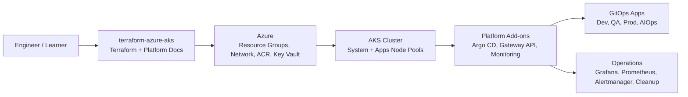

## Architecture Overview

This project builds a practical Azure AKS platform using Terraform, GitOps, monitoring, and operational runbooks.

### What this repository provides

- Terraform-based Azure AKS platform provisioning
- AKS networking, node pools, identity, ACR, and Key Vault foundation
- Argo CD and GitOps-ready platform setup
- Monitoring and observability with Prometheus, Grafana, and Alertmanager
- AIOps visibility and incident learning workflow
- Cost control, cleanup, and learner-facing platform guides

# AKS DevOps Practice Platform

A reusable Azure AKS platform and learning project for practicing real-world DevOps, DevSecOps, GitOps, observability, platform engineering, and AIOps workflows.

This project is designed for:

- Beginners learning AKS, Kubernetes, Terraform, and cloud DevOps
- Practitioners building CI/CD, DevSecOps, secrets, monitoring, and telemetry workflows
- Professionals practicing GitOps, release promotion, incident response, security hardening, platform CI, and production-style delivery
- Learners building a portfolio-ready AKS platform engineering capstone project

## Platform Architecture

The `terraform-azure-aks` repository builds the Azure platform foundation for the AKS Capstone project. It focuses on infrastructure, AKS cluster foundation, platform services, GitOps enablement, monitoring, security checks, and local operator access.

```mermaid
flowchart TB
    engineer["Platform Engineer / Learner"]

    subgraph local["Local Workstation"]
        terraform["Terraform CLI"]
        azcli["Azure CLI"]
        kubectl["kubectl"]
        helm["Helm"]
        localScripts["Local UI Helper Scripts"]
    end

    subgraph repo["terraform-azure-aks Repository"]
        tfRoot["Terraform Root Modules"]
        tfModules["Reusable Terraform Modules"]
        tfCI["Terraform Platform CI"]
        capstoneDocs["Capstone Stage Guides"]
        cleanupDocs["Cost and Cleanup Guide"]
    end

    subgraph azure["Azure Subscription"]
        budget["Azure Budget and Cost Alerts"]
        tfState["Terraform State Storage"]
        rg["Azure Resource Groups"]
        network["VNet, Subnets, Public IP, Load Balancer"]
        acr["Azure Container Registry"]
        keyvault["Azure Key Vault"]
        identity["Managed Identity and Workload Identity"]
    end

    subgraph aks["AKS Platform"]
        cluster["AKS Cluster"]
        systemPool["System Node Pool"]
        appsPool["Apps Node Pool"]
        gateway["NGINX Gateway API"]
        argocd["Argo CD"]
        monitoring["Prometheus, Grafana, Alertmanager"]
        otel["OpenTelemetry Collector"]
    end

    subgraph privateAccess["Private Local Access"]
        grafanaUI["Grafana localhost"]
        prometheusUI["Prometheus localhost"]
        alertmanagerUI["Alertmanager localhost"]
        aiopsUI["AIOps Dashboard localhost"]
    end

    engineer --> terraform
    engineer --> azcli
    engineer --> kubectl
    engineer --> helm
    engineer --> localScripts

    terraform --> tfRoot
    tfRoot --> tfModules
    tfCI --> tfRoot
    capstoneDocs --> engineer
    cleanupDocs --> engineer

    terraform --> tfState
    terraform --> rg
    terraform --> network
    terraform --> acr
    terraform --> keyvault
    terraform --> identity
    terraform --> cluster

    budget --> engineer

    cluster --> systemPool
    cluster --> appsPool
    cluster --> gateway
    cluster --> argocd
    cluster --> monitoring
    cluster --> otel

    localScripts --> grafanaUI
    localScripts --> prometheusUI
    localScripts --> alertmanagerUI
    localScripts --> aiopsUI

    grafanaUI --> monitoring
    prometheusUI --> monitoring
    alertmanagerUI --> monitoring
    aiopsUI --> monitoring
```

### Platform responsibility

This repository is responsible for:

- Creating and managing the Azure AKS platform foundation with Terraform.
- Keeping infrastructure changes reviewable through Terraform CI and security checks.
- Managing AKS networking, identity, ACR, Key Vault, node pools, and platform add-ons.
- Supporting GitOps-based application delivery through Argo CD.
- Providing monitoring and observability using Prometheus, Grafana, and Alertmanager.
- Providing private localhost access helpers for operational dashboards.
- Documenting each stage as a practical learner-facing platform engineering guide.

## AKS Capstone End-to-End Architecture

The AKS Capstone project uses a multi-repository platform engineering workflow. The app repository builds and scans the application image, the GitOps repository stores the desired Kubernetes state, and Argo CD continuously reconciles the AKS cluster.

```mermaid
flowchart TB
    learner["Platform Engineer / Learner"]

    subgraph platformRepo["terraform-azure-aks"]
        platformInfra["Terraform Platform Infrastructure"]
        platformCI["Terraform CI and Security Gates"]
        platformDocs["Platform and Capstone Guides"]
        localUI["Local UI Helper Scripts"]
    end

    subgraph appRepo["aks-capstone-store-app"]
        appSource["Store App Source Code"]
        appCI["GitHub Actions CI"]
        securityScans["Secret Scan, Source Scan, Image Scan"]
        devVerify["End-to-End Dev Verification"]
    end

    subgraph registry["Azure Container Registry"]
        imageTags["store-front Image Tags"]
    end

    subgraph gitopsRepo["aks-capstone-gitops"]
        devOverlay["Dev Overlay"]
        qaOverlay["QA Overlay"]
        prodOverlay["Prod Overlay"]
        gitopsValidation["GitOps Manifest Validation"]
        promotionWorkflow["QA and Prod Promotion Workflow"]
        aiopsDemoManifest["AIOps Demo Manifests"]
        aiopsDashboardManifest["AIOps Dashboard Manifests"]
        aiopsRules["AIOps Prometheus Rules"]
    end

    subgraph argocd["Argo CD"]
        devApp["capstone-store-dev"]
        qaApp["capstone-store-qa"]
        prodApp["capstone-store-prod"]
        aiopsDemoApp["capstone-aiops-demo"]
        aiopsDashboardApp["capstone-aiops-dashboard"]
        aiopsMonitoringApp["capstone-aiops-monitoring"]
        namespaceApp["capstone-namespaces"]
    end

    subgraph aks["AKS Cluster"]
        subgraph devNS["capstone-dev"]
            devStoreFront["store-front"]
            devProduct["product-service"]
            devOrder["order-service"]
            devMakeline["makeline-service"]
            devMongo["MongoDB"]
            devRabbit["RabbitMQ"]
            devAdmin["store-admin"]
            devWorkers["virtual-customer / virtual-worker"]
        end

        subgraph qaNS["capstone-qa"]
            qaStoreFront["QA store-front"]
            qaServices["QA supporting services"]
        end

        subgraph prodNS["capstone-prod"]
            prodStoreFront["Prod store-front"]
            prodServices["Prod supporting services"]
        end

        subgraph aiopsNS["capstone-aiops"]
            aiopsDemo["AIOps Demo Service"]
            aiopsDashboard["AIOps Dashboard"]
        end

        subgraph monitoringNS["monitoring"]
            prometheus["Prometheus"]
            alertmanager["Alertmanager"]
            grafana["Grafana"]
            prometheusRule["PrometheusRule"]
        end

        gateway["Gateway API / HTTPRoute"]
    end

    subgraph operations["Operational Verification"]
        k6["k6 Load Test"]
        grafanaDashboards["Grafana Dashboards"]
        prometheusQueries["Prometheus Queries"]
        alerts["Alertmanager Alerts"]
        aiopsFlow["AIOps Incident Visibility"]
    end

    learner --> platformRepo
    learner --> appRepo
    learner --> gitopsRepo

    platformInfra --> aks
    platformCI --> platformInfra
    platformDocs --> learner
    localUI --> grafana
    localUI --> prometheus
    localUI --> alertmanager
    localUI --> aiopsDashboard

    appSource --> appCI
    appCI --> securityScans
    securityScans --> imageTags
    appCI --> devOverlay

    imageTags --> devStoreFront
    imageTags --> qaStoreFront
    imageTags --> prodStoreFront

    devOverlay --> gitopsValidation
    qaOverlay --> gitopsValidation
    prodOverlay --> gitopsValidation
    promotionWorkflow --> qaOverlay
    promotionWorkflow --> prodOverlay

    gitopsValidation --> devApp
    gitopsValidation --> qaApp
    gitopsValidation --> prodApp

    aiopsDemoManifest --> aiopsDemoApp
    aiopsDashboardManifest --> aiopsDashboardApp
    aiopsRules --> aiopsMonitoringApp

    namespaceApp --> aks
    devApp --> devNS
    qaApp --> qaNS
    prodApp --> prodNS
    aiopsDemoApp --> aiopsNS
    aiopsDashboardApp --> aiopsNS
    aiopsMonitoringApp --> monitoringNS

    gateway --> devStoreFront

    devStoreFront --> devProduct
    devStoreFront --> devOrder
    devOrder --> devRabbit
    devMakeline --> devMongo
    devWorkers --> devRabbit
    devAdmin --> devProduct

    prometheusRule --> prometheus
    prometheus --> alertmanager
    prometheus --> grafana
    prometheus --> aiopsDashboard
    aiopsDemo --> prometheusRule

    devVerify --> imageTags
    devVerify --> gitopsRepo
    devVerify --> devApp
    devVerify --> devStoreFront
    devVerify --> gateway

    k6 --> gateway
    grafanaDashboards --> grafana
    prometheusQueries --> prometheus
    alerts --> alertmanager
    aiopsFlow --> aiopsDashboard
```

### Capstone workflow

The capstone demonstrates a production-style delivery and operations flow:

1. Terraform creates the AKS platform foundation.
2. GitHub Actions validates Terraform formatting, configuration, linting, and security checks.
3. Application code changes are built and scanned in the app repository.
4. A container image is pushed to Azure Container Registry.
5. The Dev GitOps overlay is updated with the new image tag.
6. GitOps validation checks YAML syntax, Kustomize rendering, and Kubernetes schema correctness.
7. Argo CD reconciles the desired state into AKS.
8. Dev release verification checks ACR, GitOps desired state, Argo CD health, AKS rollout, and Gateway response.
9. QA and Prod use a build-once, promote-same-image workflow.
10. Prometheus, Alertmanager, Grafana, and the AIOps Dashboard provide operational visibility.
11. AIOps alert detection shows service endpoint incidents and recovery status.
12. k6 load testing validates that the application remains healthy under controlled traffic.
13. Cost and cleanup guidance helps keep the learning environment safe, affordable, and responsible.

### Repository relationship

| Repository | Main responsibility |
|---|---|
| `terraform-azure-aks` | Azure platform, AKS infrastructure, Terraform CI, monitoring access helpers, and capstone documentation |
| `aks-capstone-store-app` | Application source code, image build, security scanning, ACR push, Dev GitOps update, and Dev verification |
| `aks-capstone-gitops` | Kubernetes desired state, environment overlays, Argo CD applications, GitOps validation, promotion workflow, and AIOps manifests |

## Project areas

This repository contains two main learning areas:

- Hands-on labs
- Enterprise AKS capstone project

## Documentation

Official documentation:

- English: [docs/en](docs/en/README.md)
- සිංහල: [docs/si](docs/si/README.md)

The capstone stage guides are currently written in Sinhala-first format for practical step-by-step learning.

## Hands-on labs

The hands-on labs are organized by learning level:

- Beginner labs: AKS and Kubernetes basics
- Practitioner labs: CI/CD, DevSecOps, secrets, monitoring, and telemetry
- Professional labs: GitOps, release strategies, incident troubleshooting, and security hardening
- AIOps labs: AI-assisted incident analysis and remediation concepts

Start here:

- [Labs index](labs/README.md)
- [AI Ops labs](labs/aiops/README.md)
- [Lab capability requirements](labs/LAB_REQUIREMENTS.md)

This platform is modular. You can provision a minimal AKS cluster for your own testing, or enable additional capabilities for the labs you want to complete.

## Enterprise AKS capstone

The capstone project is the main end-to-end platform engineering project in this repository.

Start here:

- [Capstone index](capstone/README.md)

The capstone covers:

- Terraform-based AKS platform provisioning
- Remote Terraform state backend
- Azure Container Registry integration
- Argo CD GitOps foundation
- Gateway API and NGINX Gateway Fabric
- Prometheus, Grafana, and Alertmanager monitoring
- OpenTelemetry observability
- Dev / QA / Prod GitOps environments
- GitHub Actions CI/CD
- DevSecOps quality gates
- GitOps manifest validation
- End-to-end Dev release verification
- Dev to QA to Prod promotion
- Terraform platform CI with TFLint and Checkov
- AIOps PR remediation workflow
- AIOps alert detection and dashboard visibility
- Load testing and observability verification

## Capstone repository model

The capstone uses three repositories.

### Platform repository

Repository:

    terraform-azure-aks

Purpose:

    Terraform platform infrastructure
    AKS platform setup
    platform CI
    capstone guides
    local UI helper scripts

### Application repository

Repository:

    aks-capstone-store-app

Purpose:

    application source code
    GitHub Actions application CI
    Dev image build and scan
    ACR push
    Dev GitOps update
    Dev release verification

### GitOps repository

Repository:

    aks-capstone-gitops

Purpose:

    Kubernetes manifests
    Kustomize overlays
    Argo CD applications
    Dev / QA / Prod desired state
    GitOps validation pipeline
    promotion workflow
    AIOps monitoring and dashboard manifests

## Current platform capabilities

- Terraform-based AKS platform
- Remote Terraform backend support
- VNet and AKS subnet
- AKS system and user node pools
- Azure Container Registry
- Gateway API with NGINX Gateway Fabric
- Shared platform Gateway
- Prometheus, Grafana, and Alertmanager
- kube-state-metrics and node-exporter
- OpenTelemetry Collector
- Argo CD GitOps
- Dev / QA / Prod application environments
- GitHub Actions CI/CD
- Gitleaks secret scanning
- Trivy source and image scanning
- Kustomize overlays
- kubeconform manifest validation
- TFLint and Checkov platform CI
- AIOps PR remediation
- AIOps alert visibility
- AIOps Incident Dashboard UI
- Docker-based k6 load testing

## UI access model

The project keeps operational UIs separated.

### Monitoring UI

Used for:

    metrics
    alerts
    pod and node health
    resource usage
    observability dashboards

Examples:

    Grafana
    Prometheus
    Alertmanager

### Argo CD UI

Used for:

    GitOps sync status
    health status
    Git revision
    manifest diff
    sync history

### AIOps UI

Used for:

    active incident visibility
    alert evidence
    root cause context
    remediation guidance
    recovery status

Local UI helper scripts:

    scripts/local-ui/start-local-uis.sh
    scripts/local-ui/status-local-uis.sh
    scripts/local-ui/stop-local-uis.sh

Local UI URLs:

    AIOps Dashboard: http://localhost:8088
    Grafana:         http://localhost:3000
    Prometheus:      http://localhost:9090
    Alertmanager:    http://localhost:9093

## Main workflows

### Platform repository workflow

Workflow:

    Terraform Platform CI

Purpose:

    Terraform formatting
    Terraform init and validate
    TFLint validation
    Checkov IaC scan
    platform CI summary

### Application repository workflows

Main workflows:

    Build store-front and deploy Dev via GitOps
    Verify Dev release end-to-end

Legacy workflow:

    Legacy - Build store-front image to ACR

### GitOps repository workflows

Main workflows:

    Validate GitOps manifests
    Promote store-front image

Purpose:

    YAML validation
    Kustomize render
    kubeconform validation
    Dev / QA / Prod manifest safety
    image promotion

## Monitoring and load testing

The capstone includes a monitoring and observability verification flow.

It verifies:

    Grafana dashboards are accessible
    Prometheus metrics are queryable
    Alertmanager shows alerts
    AIOps Dashboard reflects Prometheus alert state
    Docker-based k6 can generate controlled load
    store-front remains healthy during load
    CPU, memory, and network metrics are visible

The load test uses Docker-based k6, so local k6 installation is not required.

## Cost and safety notes

This project can create Azure resources that cost money.

Important safety points:

    Keep budget alerts enabled.
    Avoid unnecessary public LoadBalancer services.
    Prefer ClusterIP for internal services.
    Stop local UI port-forwards when not needed.
    Clean up resources when the lab or project is finished.
    Keep Terraform state safe.
    Do not commit secrets, tokens, personal paths, private emails, or live environment-specific IP addresses.

## Roadmap

The full learning and project roadmap is tracked here:

- [ROADMAP.md](ROADMAP.md)

## License and usage

This repository is publicly visible for educational, portfolio, and reference purposes.

Copyright (c) 2026 Andrew Ferdinandus. All rights reserved.

You may view this repository and fork it on GitHub for personal learning and reference.

You may not copy, redistribute, re-upload, publish, sublicense, sell, or use this project or substantial parts of it in another repository, course, product, or commercial work without written permission from the author.

Forks should preserve attribution to the original repository and author.

For usage restrictions, see [NOTICE.md](NOTICE.md).
