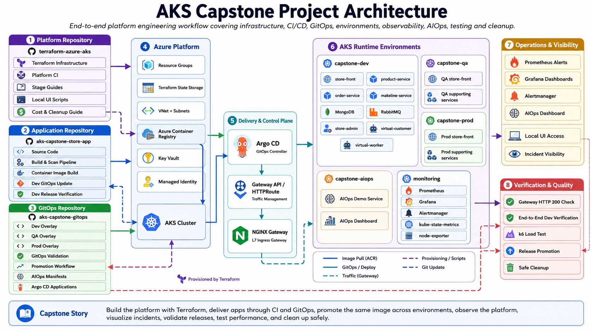

# Enterprise AKS DevOps / DevSecOps / Platform Engineering Capstone

මෙම capstone project එකේදී Azure AKS මත production-style platform engineering project එකක් step by step build කරනවා.

මෙය simple app deployment lab එකක් නෙවෙයි. මෙහි අරමුණ වන්නේ real-world cloud platform එකක තියෙන ප්‍රධාන කොටස් එකට connect කරලා ඉගෙනගැනීමයි.

මෙම project එකෙන් cover කරන්නේ:

    Terraform මගින් AKS platform එක build කිරීම
    Argo CD මගින් GitOps workflow එක build කිරීම
    Gateway API සහ NGINX Gateway Fabric setup කිරීම
    Prometheus, Grafana, Alertmanager මගින් monitoring setup කිරීම
    OpenTelemetry මගින් observability setup කිරීම
    GitHub Actions මගින් application CI/CD build කිරීම
    DevSecOps scans සහ quality gates add කිරීම
    Dev, QA, Prod environments අතර promotion workflow එක build කිරීම
    Terraform platform CI add කිරීම
    AIOps PR remediation workflow එක prove කිරීම
    AIOps Incident Dashboard UI එක add කිරීම

## Capstone Project Architecture

  

## Project එකේ official story එක

මෙම capstone project එකේ official story එක මෙහෙමයි:

1. Terraform මගින් AKS platform එක provision කරනවා.
2. Kubernetes access සහ cluster verification කරනවා.
3. Argo CD install කරලා GitOps foundation එක setup කරනවා.
4. Gateway API සහ NGINX Gateway Fabric setup කරනවා.
5. Monitoring stack එක install කරලා Grafana / Prometheus / Alertmanager setup කරනවා.
6. OpenTelemetry observability foundation එක add කරනවා.
7. Capstone Store app එක Dev environment එකට GitOps මගින් deploy කරනවා.
8. App capacity, node pool, cost guardrails, සහ Terraform drift fix කරනවා.
9. Dev app supporting components add කරනවා.
10. store-front image එක ACR එකෙන් build/deploy කරනවා.
11. GitHub Actions OIDC මගින් ACR build foundation එක හදනවා.
12. CI pipeline එක GitOps repo එක update කරලා Dev deploy කරනවා.
13. DevSecOps quality gates add කරනවා.
14. GitOps manifest validation pipeline එක add කරනවා.
15. Dev release end-to-end verify කරනවා.
16. Dev සිට QA සහ Prod දක්වා same image promote කරනවා.
17. Pipeline visibility සහ release flow explain කරනවා.
18. Terraform platform CI සහ security gates add කරනවා.
19. AIOps PR remediation workflow එක prove කරනවා.
20. AIOps Incident Dashboard UI එක add කරනවා.

## AIOps scope

මෙම project එකේ AIOps කොටස දැනට cover කරන්නේ:

    incident evidence collect කිරීම
    root cause explain කිරීම
    safe GitHub PR remediation කිරීම
    human review සහ merge කිරීම
    GitOps validation run වීම
    Argo CD මගින් recovery apply වීම
    AIOps dashboard එකෙන් incident report පෙන්වීම

AIOps fix එක direct cluster patch එකක් ලෙස කරන්නේ නැහැ. Fix එක GitHub PR එකක් ලෙස create කරලා human approval එකෙන් පස්සේ GitOps workflow එකෙන් apply වෙනවා.

## Tool stack

මෙම project එකේ main tools:

    Terraform
    Azure AKS
    Azure Container Registry
    GitHub Actions
    Argo CD
    Gateway API
    NGINX Gateway Fabric
    Prometheus
    Grafana
    Alertmanager
    OpenTelemetry Collector
    Trivy
    Gitleaks
    Checkov
    TFLint
    kubeconform
    Kustomize
    AIOps PR remediation
    AIOps Incident Dashboard

## Repository model

මෙම capstone project එක repositories තුනකින් manage කරනවා.

## 1. Platform repository

Repository:

    terraform-azure-aks

මෙම repo එකේ තියෙන්නේ:

    Terraform platform infrastructure
    AKS platform setup
    platform CI
    capstone Sinhala guides
    local UI helper scripts

## 2. Application repository

Repository:

    aks-capstone-store-app

මෙම repo එකේ තියෙන්නේ:

    application source code
    GitHub Actions application CI
    Dev image build and scan
    ACR push
    Dev GitOps update
    Dev release verification

## 3. GitOps repository

Repository:

    aks-capstone-gitops

මෙම repo එකේ තියෙන්නේ:

    Kubernetes manifests
    Kustomize overlays
    Argo CD applications
    Dev / QA / Prod desired state
    GitOps validation pipeline
    promotion workflow
    AIOps demo සහ dashboard manifests

## Environment model

Application environments:

    Dev
    QA
    Prod

Main namespaces:

    capstone-dev
    capstone-qa
    capstone-prod
    capstone-aiops-demo
    capstone-aiops

Dev, QA, Prod environments GitOps overlays මගින් manage කරනවා.

## UI separation

මෙම project එකේ operational UIs වෙන වෙනම තබනවා.

## Monitoring UI

Monitoring UI එකෙන් බලන්නේ:

    metrics
    alerts
    pod health
    node health
    resource usage
    observability dashboards

Examples:

    Grafana
    Prometheus
    Alertmanager

## Argo CD UI

Argo CD UI එකෙන් බලන්නේ:

    application sync status
    health status
    Git revision
    manifest diff
    sync history
    deployment tree

## AIOps UI

AIOps UI එකෙන් බලන්නේ:

    incident summary
    evidence
    root cause
    remediation PR
    recovery status

AIOps Dashboard local URL:

    http://localhost:8088

Local UI helper scripts:

    scripts/local-ui/start-local-uis.sh
    scripts/local-ui/status-local-uis.sh
    scripts/local-ui/stop-local-uis.sh

## Capstone stage guide index

| Stage | Guide |
|---|---|
| 00 | [Project Overview](00-project-overview/README.si.md) |
| 01 | [Terraform Platform Provisioning](01-terraform-platform-provisioning/README.si.md) |
| 02 | [Kubernetes Access and Verification](02-kubernetes-access-and-verification/README.si.md) |
| 03 | [Argo CD GitOps Foundation](03-argocd-gitops-foundation/README.si.md) |
| 04 | [Gateway API and NGINX Gateway Fabric](04-gateway-api-nginx-gateway-fabric/README.si.md) |
| 05 | [Monitoring, Alerting, and Notifications](05-monitoring-alerting-notifications/README.si.md) |
| 06 | [OpenTelemetry Observability](06-opentelemetry-observability/README.si.md) |
| 07 | [Capstone Store Dev GitOps Deployment](07-capstone-store-dev-gitops-deployment/README.si.md) |
| 08 | [Dev App Expansion, Capacity Planning, Cost Guardrails, and Terraform Import](08-expand-dev-app-capacity-and-cost-guardrails/README.si.md) |
| 09 | [Dev App Supporting Components](09-add-dev-app-supporting-components/README.si.md) |
| 10 | [ACR Image Build and GitOps Deploy](10-acr-image-build-and-gitops-deploy/README.si.md) |
| 11 | [GitHub Actions ACR Build Foundation](11-github-actions-acr-build-foundation/README.si.md) |
| 12 | [CI Updates GitOps and Deploys Dev](12-ci-updates-gitops-and-deploys-dev/README.si.md) |
| 13 | [App DevSecOps CI Gates](13-app-devsecops-ci-gates/README.si.md) |
| 14 | [GitOps Manifest Validation Pipeline](14-gitops-manifest-validation-pipeline/README.si.md) |
| 15 | [End-to-End Dev Release Verification](15-end-to-end-dev-release-verification/README.si.md) |
| 16 | [Dev to QA to Prod Promotion Workflow](16-dev-qa-prod-promotion-workflow/README.si.md) |
| 17 | [Pipeline Visibility and Release Flow](17-pipeline-visibility-and-release-flow/README.si.md) |
| 18 | [Terraform Platform CI and Pipeline Visibility](18-terraform-platform-ci-and-pipeline-visibility/README.si.md) |
| 19 | [AIOps PR Remediation](19-aiops-pr-remediation/README.si.md) |
| 20 | [AIOps Incident Dashboard UI](20-aiops-incident-dashboard-ui/README.si.md) |
| 21 | [AIOps Alert Detection and Dashboard Visibility](21-aiops-alert-detection-and-dashboard-visibility/README.si.md) |
| 22 | [Load Testing and Observability Verification](22-load-testing-and-observability-verification/README.si.md) |
| 23 | [Final Demo and Run Order](23-final-demo-and-run-order/README.si.md) |

## Main workflows

## Platform repository workflow

Repository:

    terraform-azure-aks

Workflow:

    Terraform Platform CI

මෙම workflow එකෙන් කරන්නේ:

    Terraform format check
    Terraform init and validate
    TFLint validation
    Checkov IaC scan
    platform CI summary

## Application repository workflows

Repository:

    aks-capstone-store-app

Main workflows:

    Build store-front and deploy Dev via GitOps
    Verify Dev release end-to-end

Legacy workflow:

    Legacy - Build store-front image to ACR

Legacy workflow එක earlier stages reference සඳහා තබා තිබෙනවා. Main Dev deployment workflow එක GitOps-based workflow එකයි.

## GitOps repository workflows

Repository:

    aks-capstone-gitops

Main workflows:

    Validate GitOps manifests
    Promote store-front image

මෙම workflows වලින් කරන්නේ:

    YAML syntax validation
    Kustomize render
    kubeconform validation
    QA / Prod promotion
    GitOps summary

## Current stable checkpoint

Current checkpoint එකේ expected Argo CD state එක:

    capstone-store-dev Synced / Healthy
    capstone-store-qa Synced / Healthy
    capstone-store-prod Synced / Healthy
    capstone-aiops-demo Synced / Healthy
    capstone-aiops-dashboard Synced / Healthy

AIOps Dashboard:

    http://localhost:8088

## Recommended demo flow

Project demo එකක් කරන විට හොඳ order එක:

1. Platform repository structure පෙන්වන්න.
2. Terraform Platform CI පෙන්වන්න.
3. Application CI workflow පෙන්වන්න.
4. GitOps validation workflow පෙන්වන්න.
5. Dev release verification workflow පෙන්වන්න.
6. QA / Prod promotion workflow පෙන්වන්න.
7. Argo CD applications පෙන්වන්න.
8. Monitoring UI explain කරන්න.
9. AIOps Dashboard UI පෙන්වන්න.
10. AIOps PR remediation flow explain කරන්න.

## Cost and safety notes

මෙම project එක Azure resources create කරන නිසා cost generate විය හැක.

Safety points:

    budget alerts enabled තබන්න
    unnecessary public LoadBalancer services avoid කරන්න
    internal services සඳහා ClusterIP use කරන්න
    local UI port-forwards අවශ්‍ය නැති විට stop කරන්න
    project finish කළාම resources cleanup කරන්න
    Terraform state safe තබන්න
    secrets, tokens, personal paths, live IP-specific notes commit කරන්න එපා

- [Stage 24 - Cost and Cleanup Guide](24-cost-and-cleanup-guide/README.si.md)
